# 🔒 HUSHBOX - Your Digital Privacy Vault  

HUSHBOX is a next-generation, privacy-first communication tool that redefines secure messaging. By combining military-grade encryption with QR code technology, HUSHBOX enables users to exchange confidential messages without ever relying on external servers.

Unlike traditional platforms, all encryption and decryption occur locally on your device, ensuring your data remains completely under your control. Messages are never stored, logged, or transmitted through third-party infrastructure. Instead, encrypted QR codes can be shared via any medium, while your passphrase remains separate—ensuring maximum security even if the message is intercepted.

🔐 **Zero-Server Architecture** – Messages never touch external servers  
🕵️ **Ephemeral Design** – No tracking, no storage, no metadata  
🔓 **Open Source** – Transparent and auditable security  
📱 **PWA Ready** – Install as a lightweight progressive web app  
📴 **Offline Functionality** – Works seamlessly without internet access  

**Perfect For**:  
🔏 Privacy-conscious individuals | 🏢 Enterprises handling sensitive data | 💼 Legal/medical professionals | 🛡️ Security researchers | ✈️ Travelers in high-risk areas  

---

## 🚀 Key Features

| **Category** | **Key Features** |
|--------------|------------------|
| 🔐 **Core Security** | - AES-256-GCM encryption with HMAC integrity protection <br> - PBKDF2 key derivation (310,000+ iterations) <br> - Compressed payloads for efficient QR encoding <br> - Anti-brute force protection (5 attempts limit) |
| 📱 **User Experience** | - Responsive design with mobile-first approach <br> - Real-time passphrase strength indicators <br> - Custom branded QR codes <br> - Camera QR scanning <br> - Secure sharing capabilities |
| 🛡️ **Advanced Protections** | - IV time-stamping for replay attack prevention <br> - Memory sanitization after operations <br> - Secure content disposal <br> - Tamper-evident payload design |
| ⚙️ **Customizable Security** | - Adjustable PBKDF2 iterations (100K-1M) <br> - Multiple security levels (AES-128 to AES-256 + HMAC) <br> - Configurable session timeouts <br> - Auto-wipe sensitive data |

---

## ⚙️ Technical Stack

### Frontend Architecture  


### Encryption Flow

```mermaid
sequenceDiagram
    Usuario->>Aplicación: Ingresa mensaje + passphrase
    Aplicación->>Crypto: Validar passphrase (zxcvbn)
    Crypto->>Crypto: Generar salt (32B) + IV (16B)
    Crypto->>Crypto: Derivar clave (PBKDF2-HMAC-SHA256)
    Crypto->>Crypto: Comprimir mensaje (pako DEFLATE)
    Crypto->>Crypto: Encriptar (AES-256-GCM)
    Crypto->>QR: Convertir a Base64
    QR->>UI: Generar código QR
    UI->>Usuario: Mostrar QR seguro
```


### Decryption Flow


### Dependencies  
| Library | Version | Purpose |
|---------|---------|---------|
| **pako** | 2.1.0 | Compression DEFLATE |
| **qrcode** | 1.5.1 | QR Generation |
| **jsQR** | 1.4.0 | QR Decoding |
| **jspdf** | 2.5.1 | PDF Export |
| **zxcvbn** | 4.4.2 | Passphrase Strength Validation |

- **UI Framework**: Pure CSS Grid/Flexbox
- **Icons**: Font Awesome 6
- **No Build Process**: Zero dependencies, runs directly in browser

---

## 🛠️ Installation & Usage  

### Project Structure
```bash
HUSHBOX/
├── index.html          # Main application
├── script.js           # Core encryption logic
├── styles.css          # Responsive styling
├── manifest.json       # PWA configuration
├── favicon.png
├── assets/
│   └── icons/          # Application icons
├── legal/
│   ├── LICENSE.md
│   ├── privacy-policy.md
│   └── terms-of-service.md
└── README.md
```

### Local Deployment
```bash
git clone https://github.com/MPetovick/HUSHBOX.git
cd HUSHBOX

# Serve using local web server
python3 -m http.server 8000
# or
npx serve .
```

Open `http://localhost:8000` in any modern browser.

### Web Version  
**[https://www.hushbox.online](https://www.hushbox.online)**

### User Guide

1. **Encrypt a Message**:
   - Enter a strong passphrase (12+ characters with complexity)
   - Type your secret message 
   - Click "Encrypt" to generate secure QR code
   - Share QR via any channel (print, email, messaging)

2. **Decrypt a Message**:
   - Click camera icon to scan QR or upload QR image
   - Enter the passphrase (shared via separate secure channel)
   - Click "Decrypt" to reveal message

3. **Additional Features**:
   - Generate secure random passphrases
   - Export encrypted messages as PDF
   - Manage message history with import/export
   - Customize security settings

---

## 🔄 Workflow Examples

### Offline Secure Communication


### Digital Document Backup


### Enterprise Credential Distribution


---

## 🛡️ Security Specifications  

### Cryptography  
| Parameter | Value | Description |
|-----------|-------|-------------|
| Algorithm | AES-256-GCM | Authenticated encryption |
| Key Derivation | PBKDF2-HMAC-SHA256 | 100,000-1,000,000 iterations |
| Salt | 32 bytes | Cryptographically random |
| IV | 16 bytes | Unique per encryption |
| HMAC | SHA-256 | Integrity protection |
| Compression | DEFLATE Level 6 | For messages >100 chars |

### Passphrase Requirements  
- **Minimum Length**: 12 characters
- **Complexity**: Upper/lowercase, numbers, symbols
- **Strength Validation**: Real-time zxcvbn analysis
- **No Storage**: Passphrases never persisted

### Security Features
- **Client-Side Only**: All operations occur in browser
- **Memory Sanitization**: Sensitive data wiped after use
- **Session Management**: Configurable timeouts
- **Auto-Wipe**: Optional automatic data clearing
- **No Tracking**: Zero analytics or telemetry

---

## 📈 Business Applications  

### Industry Solutions  
| Sector | Use Case |
|--------|----------|
| **Finance** | Secure credentials and sensitive data exchange |
| **Healthcare** | HIPAA-compliant patient information sharing |
| **Legal** | Confidential document transmission |
| **Government** | Secure material distribution |
| **Enterprise** | Password and credential rotation |

### Enterprise Benefits  
- **Zero Infrastructure**: No servers to maintain  
- **Compliance Ready**: Meets privacy regulations  
- **Easy Deployment**: Single HTML file deployment  
- **Cross-Platform**: Works on all modern browsers  

---

## ⚠️ Security Best Practices  

### For All Users  
1. 🔑 Use 15+ character complex passphrases  
2. 📲 Share passphrases via secure channels (Signal, encrypted email)  
3. 🧹 Clear history after sensitive operations  
4. 🔒 Use in private/incognito browsing sessions  
5. 📱 Verify the application URL before use

### For Enterprises  
- Train employees on proper passphrase management
- Establish clear policies for sensitive data exchange
- Regularly update security configurations
- Conduct periodic security reviews

### Threat Mitigation


---

## 🎯 Use Case Examples

### Crypto Wallet Backup [MnemoniQR](https://mnemoniqr.vercel.app/)


### Medical Data Transfer
- HIPAA-compliant patient data exchange
- Temporary access with auto-expiration
- Audit trail for compliance
- Emergency access protocols

### Secure File Transfer
- Convert small files to encrypted QR codes
- Print for physical transfer
- No file size limits for digital QR sharing
- PDF export for documentation

---

## 🔧 Configuration Options

### Security Settings
- **PBKDF2 Iterations**: 100,000 to 1,000,000
- **Security Level**: High (AES-256 + HMAC), Medium (AES-256), Low (AES-128)
- **Session Timeout**: 1-120 minutes
- **Auto Wipe**: 5, 10, 30 minutes or disabled
- **QR Error Correction**: L (7%) to H (30%)

### Customization
- Adjust security based on threat model
- Balance performance vs. security
- Configure for specific use cases
- Export settings for deployment

---

## 📜 License  
GNU Affero General Public License v3.0 - See [LICENSE](https://github.com/MPetovick/HUSHBOX/blob/main/LICENSE) for details.

## 🐛 Reporting Issues  
Found a bug or security vulnerability? Please report via:
- **Email**: hushbox.online@pm.me
- **GitHub Issues**: [Create Issue](https://github.com/MPetovick/HUSHBOX/issues)

## 🌐 Contact & Community  
- **Telegram**: [HUSHBOX Channel](https://t.me/HUSHBOX_QR)
- **Twitter**: [@HUSHBOXonline](https://twitter.com/HUSHBOXonline)
- **Documentation**: [GitHub README](https://github.com/MPetovick/HUSHBOX/blob/main/README.md)
- **Support**: hushbox.online@pm.me

---

<div align="center">
  <br>
  <strong>Privacy That Never Leaves Your Hands</strong> ♾️🔐<br>
  <strong>Try HUSHBOX → </strong> <a href="https://www.hushbox.online">www.hushbox.online</a><br>
  <em>Because your secrets should stay yours</em>
</div>

## 🚀 Quick Start
1. Visit **[hushbox.online](https://www.hushbox.online)**
2. Encrypt your first message in under 60 seconds
3. Experience truly private communication

---

*HUSHBOX v3.2.2 | Security Certificate: HBX-SEC-2025-08 | Built with ❤️ for the privacy-conscious*
